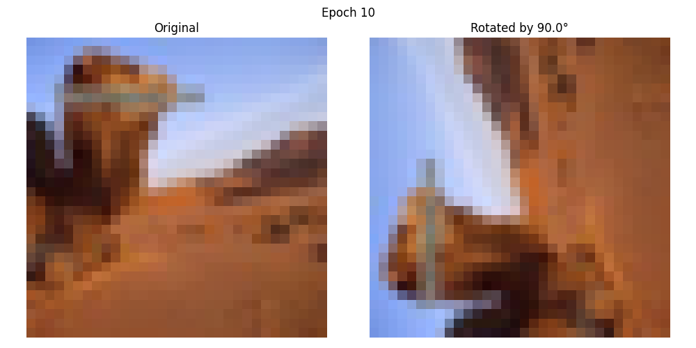

# Обучение слоя поворота изображения

Проект реализует и обучает пользовательский слой нейронной сети, который учится поворачивать изображения. Слой обучает единственный параметр - угол поворота - для преобразования входных изображений в соответствии с целевым поворотом.

## Обзор проекта

Основная цель - создать обучаемый слой поворота, который может:
- Принимать входные изображения (используется датасет CIFAR100)
- Обучать оптимальный угол поворота через обратное распространение ошибки
- Поворачивать изображения для соответствия целевому углу (π/2 или 90 градусов)

## Структура проекта

```
project/
├── configs/
│   └── config.yaml          # Конфигурационный файл с гиперпараметрами
├── src/
│   ├── model.py             # Реализация слоя поворота
│   ├── dataset.py           # Загрузка и предобработка данных
│   ├── utils.py             # Утилиты визуализации
│   |── trainer.py           # Реализация цикла обучения
│   └── train.py             # Основной скрипт обучения
├── experiments/
│   ├── checkpoints/         # Сохраненные чекпойнты модели
│   ├── logs/               # Логи обучения
│   └── visualizations/     # Сгенерированные визуализации
└── requirements.txt        # Зависимости проекта
```

## Особенности выбора датасета

В качестве датасета был выбран CIFAR100 (цветные изображения) вместо черно-белых изображений, тк при использовании чб изображений возникало бы множество локальных минимумов из-за одинаковых значений пикселей, что затрудняло бы процесс обучения. 

## Эксперименты

Было протестировано несколько конфигураций оптимизации для поиска лучшей схемы обучения:

1. SGD с lr=0.1
2. SGD с lr=0.01
3. Adam с lr=0.01
4. RMSprop с lr=0.01
5. RMSprop с lr=0.01 + ExponentialLR(gamma=0.9)
6. RMSprop с lr=0.1 + ExponentialLR(gamma=0.9)
7. RMSprop с lr=0.1 + StepLR(step_size=3)

### Результаты обучения

Все конфигурации успешно сошлись к целевому углу поворота в 90 градусов. Вот пример визуализации после обучения:



*Визуализация поворота после 10 эпох*

## Результаты

Модель успешно научилась:

- Оценивать правильный угол поворота
- Применять выученный поворот к входным изображениям
- Соответствовать целевому повороту в 90 градусов

Подробные логи обучения и визуализации можно найти в [панели Weights & Biases](https://wandb.ai/dean707dark/rotate-cifar/workspace?nw=nwuserdean707dark).

## Установка и использование

1. Установка зависимостей:
```bash
pip install -r requirements.txt
```

2. Настройка параметров обучения в `configs/config.yaml`

3. Запуск обучения:
```bash
python src/train.py
```

## Ключевые особенности

- Реализация обучаемого слоя поворота
- Поддержка различных оптимизаторов и scheduler-ов
- Отслеживание экспериментов с помощью Weights & Biases
- Визуализация результатов поворота
- Настраиваемые параметры обучения


## Выводы

Проект успешно демонстрирует, что нейронная сеть может обучиться точному повороту изображения через обратное распространение ошибки. Все протестированные конфигурации оптимизации достигли сходимости, при этом комбинация RMSprop с StepLR показала особенно стабильные результаты.

